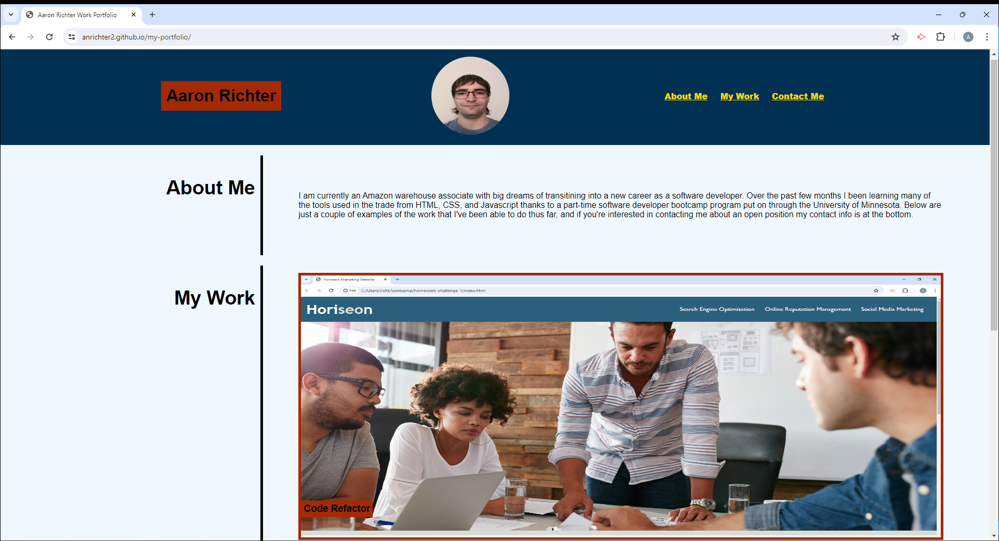
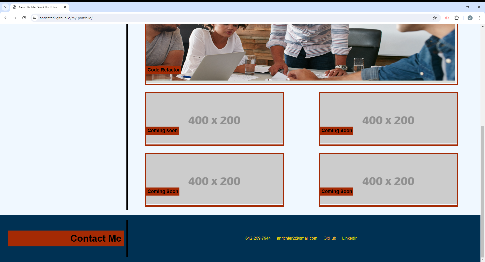

# my-portfolio

## Description

This project was to create a personal work portfolio to help me with the task of finding employment. This portfolio will have links and images to varies other projects that I have created so that I may market myself and my skill to future employers. I also have my contact information on this project so that employers who are interested in interviewing me for an open position can reach me.

## Installation

N/A

## Usage

Below are screenshots showing my work portfolio website.

Link to the deployed webpage
[My work portfolio](https://anrichter2.github.io/my-portfolio/)

## Credits

N/A

## License

N/A